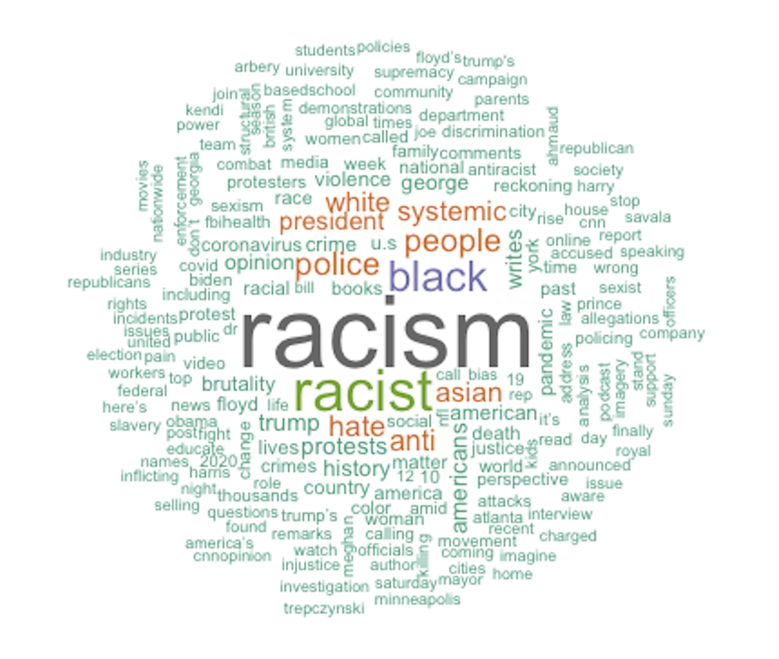

<!-- README.md is generated from README.Rmd. Please edit that file -->

```{r, include = FALSE}
knitr::opts_chunk$set(
  collapse = TRUE,
  comment = "#>"
)
```

# Does Mainstream Media Recognize the Surge in Hate Crimes Against Asian Americans?
## --- Text Analysis using Twitter Data
<!-- badges: start -->
<!-- badges: end -->


## Description

The goal of the study is to analyze the top 6 U.S. news media coverage on anti-Asian hate crimes and understand their efforts in combating against the rising tide of coronavirus-related discrimination and violence against Asian Americans. We performed exploratory analysis on the Twitter data collected between March 2020 and March 2021 and trained two supervised machine learning models to predict whether a tweet is related to AAPI hate crime or not. From the model result, we found that between March 2020 and March 2021, these media in total have less than 1% of their tweets that potentially talked about anti-Asian hate crimes. Especially prior to the Atlanta shooting event, the news media was silent in reporting hate crimes against Asian Americans despite the alarming rate of incidents. This emphasized the minimal role news media have played in combating the surge in discriminations and violence against Asian Americans.

(Final project for the Messy Data and Machine Learning class at NYU.)

<center>

*Figure 1: The Number of Times the Tweets Containing “Asian(s)” Appeared over Time*

{width=500}

*Figure 2: Top 200 Most Frequently Used Words in Tweets predicted as related to reporting of AAPI hate crimes*
</center>
## Data

We pulled the tweets of six local Asian news media accounts, NextShark, AAPI Data, Stop AAPI Hate, CAA San Francisco, Asian American Legal, and WashTheHate, and manually labeled them as related to AAPI hate crime issues or not for the training set. The testing set is the tweets of the six major U.S. news media that are most-followed on Twitter, i.e. CNN, the New York Times, Fox News, the Wall Street Journal, TIME, and the Washington Post. Using the ‘academictwitteR’ package, we pulled the tweets of these twelve accounts that were made between March 17, 2020 and March 30, 2021. The raw data can be accessed [here.](https://drive.google.com/drive/folders/19fAt2l2LK0muec4bc0MzzRKZ4Vf0ou_Q?usp=sharing)

## Folder structure

File/Folder Name  | Description
------------- | -------------
img  | Images in the README.rmd
twitter_analysis  | The script for the analysis
MDML_Report | The report for the analysis

